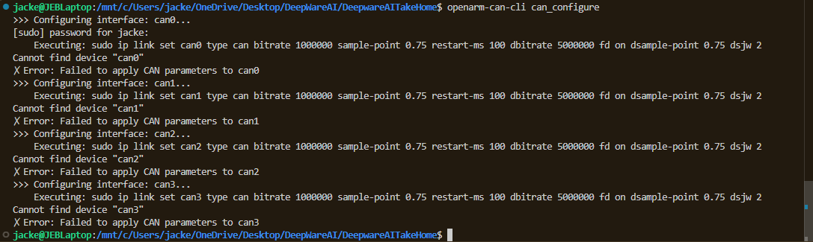

# Deepware AI Take-home Project
6/11/2026

By: Jack Biggins

## Preface ##
This code is completed as best as I can given my free time. There are many forms of improvement, but hopefully you get a sense of the knowledge and skill I have.

Chosen to ignore heap and pointers because, for the scope of this project, they will not influence runtime, as I am only using a set amount of data.

The C++ code is well documented around the main functions so someone could follow the steps taken.

## Task 1 ##
I don't own the hardware needed to complete this step, but I did take all the steps I could. I updated and opened
my VM to run Ubuntu on windows where I was able to run the commands listed on the website to install the library.
Eventually, I had to run the command "open-can-cli can_configure" where I received the error screenshotted and shown in file T1CanConfig.png in this directory.

## Task 2 ##
For this task I **simulated** the output from the arms in the form of a vector of ArmStates which in turn are a list of inviiduatl joint structs what hold
their pos, vel, and torque data. This vector is housed in the OpenArmSim class, which is a proxy for how I would interact with the true data. With simRecordData, I simulate the recorded data and input it into the vector as if it was collected.

I chose to write this in C++ because this is a typical language for lower-level operations in robotics. Suggested on website as well.

I made ZEN

## Task 3 ##
When handling data at varying timestamps that have different frequencies of recording, two main methods are used: interpolation and nearest neighbor. I went with nearest neighbor because it was the easier/more practical for the scope of this demo. Nearest neighbors has the user determining a starting time for all the components(when action 0 happened) and determining a data recording timestep. I chose a timestep that was the period of the slowest recording type, 5ms. With these pieces, you can make a list of times, and among all cameras and joints, we determine which data point happened closest to that time. This can be done in O(n) time.

Implementation: I used a function(nearestNeighbor) that takes in Timestampable classes (structs/classes that have a timestamp) and iterates through the vectors and aligns. Then all of the data sources were trimmed to the size of the shortest vector. This creates 5 camera vectors and a joints vector, all with the same length, with indices that match identical timesteps.

## Task 4 ##
While there are many ways of storing the data im going to pick the one that matches the datasetAPI folder
system that OpenArm uses (this was pasted in data.txt). This is done so it can easily be interfaced with
I encapsulated this into the static class DataStorage where I write everything into the forders in 
the manner aligning withe their api.

Design choice: .parquet is not the most practical to produce with C++, so I just added the joint data to a CVS
Design choice: because I'm simulating the data ops and actions are receiving the same data. This is not how it should 
actually be but was procticle given my already fake data.

    To get working, please run 
        uvicorn RestAPI:app --reload

q
## Task 5 ##
This was also done in fast API but was done external to the other parts due to the start and stop feature being against how
I have programmed the previous parts. This whole last step would flow better if I had a live feed of data (this is my mistake/misinterpretation).
Because of this, I let the JS simulate random data and show the user what it would be like to start and stop the episode. It does
not currenly record the data to backend but that was outside the requirments of the task. Website is boring and could be made better
but I figured functionality is what you would care about more.

    To get working, please run 
        uvicorn RestAPIWithDashboard:app --reload